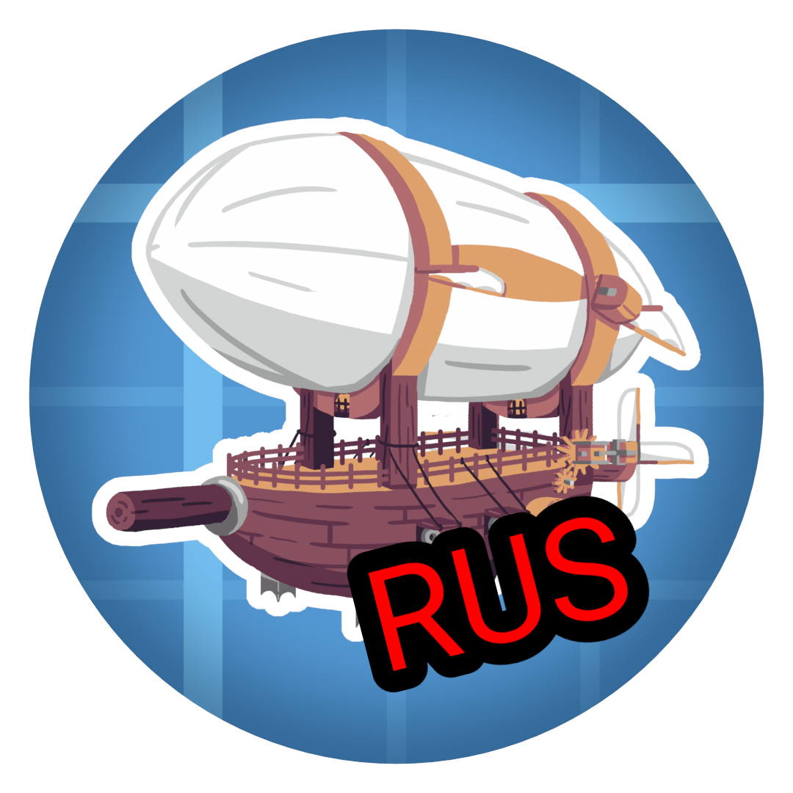

# ☁️ Create Aeronautics: Элитная Русская Локализация

  

*Здесь позже появятся бейджи скачиваний с Modrinth и CurseForge!*

**Полный, технически точный и литературно выверенный перевод грандиозного дополнения Aeronautics для мода Create.**

> ⚠️ **ВНИМАНИЕ: Это неофициальный фанатский перевод.** Данный проект никак не связан с официальной командой разработчиков Create Aeronautics.

---

## 📖 О проекте

Этот ресурспак предоставляет высококачественную русскую локализацию для мода **Create Aeronautics** и его официальных зависимостей. 

В отличие от машинных переводов, данный пак создавался с глубоким пониманием инженерной терминологии оригинального мода Create и законов аэродинамики. Никаких «оболочек для горячего воздуха» или «валов стресса» — только грамотный технический русский язык.

### ⚙️ Что входит в перевод?
Пакет включает 100% перевода для следующих модулей:
* 🛩️ **Create Aeronautics** (Аэростаты, пропеллеры, горелки, левитит)
* 🧠 **Create Simulated** (Физический движок, симуляция массы и центров тяжести)
* 🚙 **Create Offroad** (Подвеска, камнерезные колеса, буровые головки)

---

## ✨ Ключевые особенности

- **Инженерная точность:** Термины согласованы с официальной русской локализацией Create.
- **Адаптированный Ponder (Обучение):** Все внутриигровые 3D-сцены (вызываемые на `W`) переписаны в формате понятных и естественных инструкций.
- **Детальные подсказки (Shift):** Физические механики, такие как тяга, подъемная сила, аэродинамическое сопротивление и расход кинетической мощности, описаны предельно ясно.
- **Интерфейсы и логирование:** Переведены системные сообщения физического движка, интерфейсы навигационных столов и печатных машинок.

---

## ⚖️ Отказ от ответственности (Disclaimer)

Данный ресурспак распространяется «как есть» (AS IS) в соответствии с лицензией MIT.
* **Отсутствие гарантий:** Авторы перевода не несут ответственности за возможные сбои в работе игры, краши, повреждения сохранений или конфликты с другими модификациями.
* **Авторские права:** Все права на оригинальный мод, его исходный код, текстуры, модели и механики принадлежат создателям **Create Aeronautics**. Мы предоставляем исключительно файлы локализации (текст) в виде отдельного набора ресурсов.

---

## 📸 Галерея

> **Совет для разработчика:** *Сюда стоит добавить 2-3 скриншота из игры. Например, скриншот Ponder-сцены с русским текстом и скриншот инвентаря с переведенными предметами.*

<b>Нажмите, чтобы посмотреть скриншоты (В разработке)</b>

 

*(Место для ваших скриншотов)*

---

## 📥 Установка

Ресурспак устанавливается как и любой другой набор ресурсов для Minecraft.

1. Перейдите в раздел [Releases](../../releases) на GitHub (или на нашу страницу Modrinth/CurseForge).
2. Скачайте свежий `.zip` архив.
3. Откройте Minecraft, перейдите в **Настройки -> Наборы ресурсов** (Options -> Resource Packs).
4. Нажмите **«Папка с наборами»** (Open Pack Folder) и переместите туда скачанный архив.
5. Активируйте ресурспак, перенеся его в правую колонку. 
6. **Важно:** Убедитесь, что ресурспак находится **ВЫШЕ** мода Create Aeronautics в списке, чтобы игра использовала именно наш перевод!

---

## 🛠️ Совместимость

* **Версия игры:** `1.21.1`
* **Формат ресурспака:** `34`
* **Загрузчики:** NeoForge.

---

## 🤝 Вклад в проект (Сообщение об ошибках)

Заметили опечатку, кривую формулировку или непереведенный текст? Помогите сделать проект лучше!
1. Перейдите во вкладку [Issues](../../issues).
2. Создайте новую проблему, прикрепите скриншот и опишите, как текст должен звучать правильно.
3. Если вы умеете работать с Git, мы всегда рады вашим **Pull Requests**!

---

## 🙏 Благодарности и авторы

* **mishtok (mishtok125)** — Изначальный автор базового перевода [Create-Aeronautics-RU](https://github.com/mishtok125/Create-Aeronautics-RU). Эта элитная локализация выросла из его трудов.
* **Gemini 3.1 Pro (ИИ)** — Помощь в глубокой технической редактуре, стилистической полировке текста, устранении «канцелярита» и приведении терминологии к строгим стандартам мода Create.
* Разработчики **Create Aeronautics** за этот потрясающий мод.

---

  Распространяется по лицензии MIT. Вы можете свободно использовать и модифицировать этот перевод.

